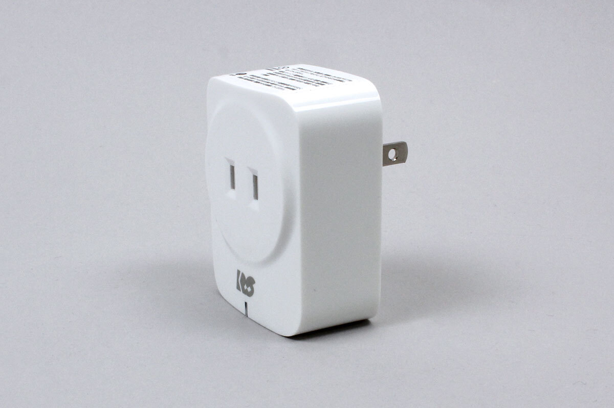

# RS_BTWATTCH2
ラトックシステムズ社製のコンセントの消費電力計で、ON/OFFも可能です。



このデバイスは事前にペアリングが必要となります。本体のボタンを３秒間押し、LEDが点滅するとペアリングモードです。
プログラムでは

1. ペアリングモードにすることでペアリングし、キーを取得し保存
2. 通常モードのデバイスに取得済みのペアリングキーで接続

### ペアリング注意事項

- keysを別のobnizIDのデバイスとシェアすることはできません。ペアリングしたそのデバイスでのみ利用できます。
- 一度ペアリングしたデバイスと2度目のペアリングはエラーとなります。ボタンを10秒以上長押しすることでリセットさせることができます。


```javascript
// Javascript Example
await obniz.ble.initWait();
const RS_BTWATTCH2 = Obniz.getPartsClass("RS_BTWATTCH2");
obniz.ble.scan.onfind = async (peripheral) => {
  if (RS_BTWATTCH2.isDevice(peripheral)) {
    console.log("found");
    const checker = new RS_BTWATTCH2(peripheral);
    if (checker.isPairingMode()) {
      const pairedKeys = await checker.firstPairingWait();
      console.log(pairedKeys);
      // use this key at the next time.
      return;
    }
    // keys = pairedKeys
    const keys = '';
    await checker.connectWait(keys);
    console.log('connected');
    // get cunnret relay state
    const status = await checker.getPowerStateWait();
    console.log(`status ${status}`);
    // change to ON
    await checker.setPowerStateWait(true);
    // get Power Consumption
    const measured = await checker.getRealTimeDataWait();
    console.log(measured);
  }
};
await obniz.ble.scan.startWait();

```

各関数について詳しくは下記をご覧ください。

[リファレンス](https://obniz.github.io/obniz/obnizjs/interfaces/parts.rs_btwattch2.rs_btwattch2.html)
