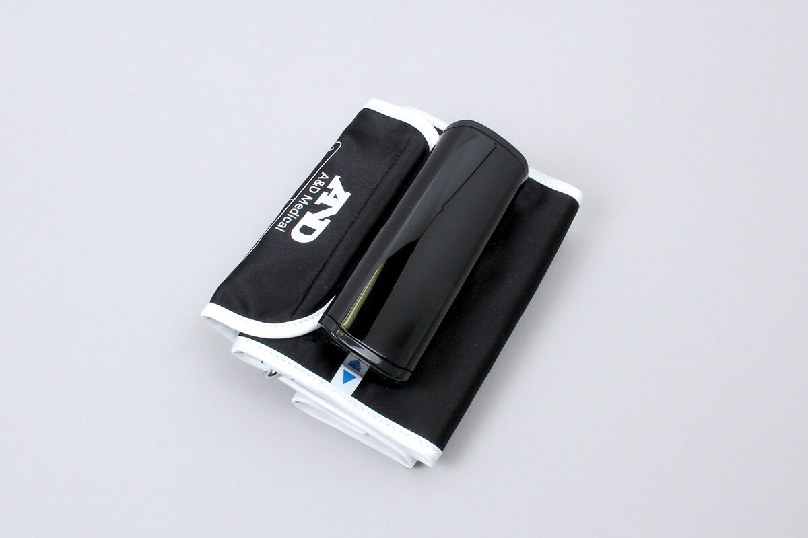

# UA1200BLE
株式会社エー・アンド・デイの血圧計です。



## isDevice(peripheral)

BLEで受信したアドバタイズ情報をもとに、UA1200BLEかどうかを判定します。

```javascript
// Javascript Example
await obniz.ble.initWait();
const UA1200BLE = Obniz.getPartsClass("UA1200BLE");
obniz.ble.scan.onfind = async (peripheral) => {
  if (UA1200BLE.isDevice(peripheral)) {
    console.log("device find");
  }
};
await obniz.ble.scan.startWait();

```

## new UA1200BLE(peripheral)

BLEで受信したアドバタイズ情報をもとに、インスタンスを作成します。

```javascript
// Javascript Example
await obniz.ble.initWait();
const UA1200BLE = Obniz.getPartsClass("UA1200BLE");
obniz.ble.scan.onfind = async (peripheral) => {
  if (UA1200BLE.isDevice(peripheral) ) {
    console.log("device find");
    const device = new UA1200BLE(peripheral);
  }
};
await obniz.ble.scan.startWait();

```


## [await]getDataWait()

デバイスに接続し、データを一括取得します。

このデバイスではデータが存在する場合も存在しない場合もadvertisementを発信します。
データがない場合接続してもデータは得られません。`isCooperationMode()`が`true`である場合はデータは存在しません。
また、取得できるデータはデバイスが未送信のデータのみです。

データ送信後、自動的にデバイスとの接続が切断されます。

```javascript
// Javascript Example
await obniz.ble.initWait();
const UA1200BLE = Obniz.getPartsClass("UA1200BLE");
obniz.ble.scan.onfind = async (peripheral) => {
  if (UA1200BLE.isDevice(peripheral) && !UA1200BLE.isCooperationMode(peripheral)) {
    console.log("find");
    const device = new UA1200BLE(peripheral);
    
    const data = await device.getDataWait();
    
    console.log(data);
  }
};
await obniz.ble.scan.startWait();

```


データフォーマットは次の通りで、血圧が mmHg もしくは kPa 形式で、脈拍が pulse/min 形式で入っています。

[https://obniz.github.io/obniz/obnizjs/interfaces/parts.ua1200ble.ua1200bleresult.html](https://obniz.github.io/obniz/obnizjs/interfaces/parts.ua1200ble.ua1200bleresult.html)

```json
{
  SystolicPressure_mmHg?: number; // ex) 128mmHg → 0x80 = 128, 0x00
  DiastolicPressure_mmHg?: number;
  MeanArterialPressure_mmHg?: number;
  SystolicPressure_kPa?: number; // ex) 17.6Kpa → 0xB0 = 176, 0xF0
  DiastolicPressure_kPa?: number;
  MeanArterialPressure_kPa?: number;
  bodyMoved?: number;
  cuffFitLoose?: boolean;
  irregularPulseDetected?: boolean;
  improperMeasurement?: boolean;
  PulseRate?: number;
}
```
